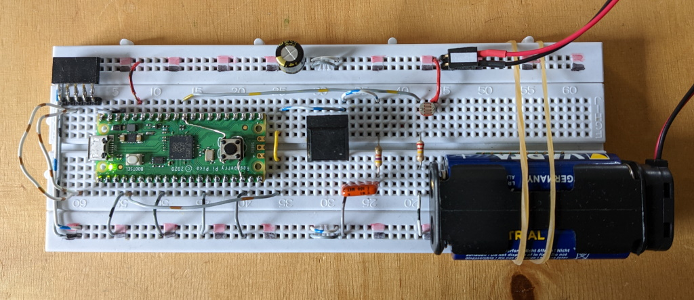
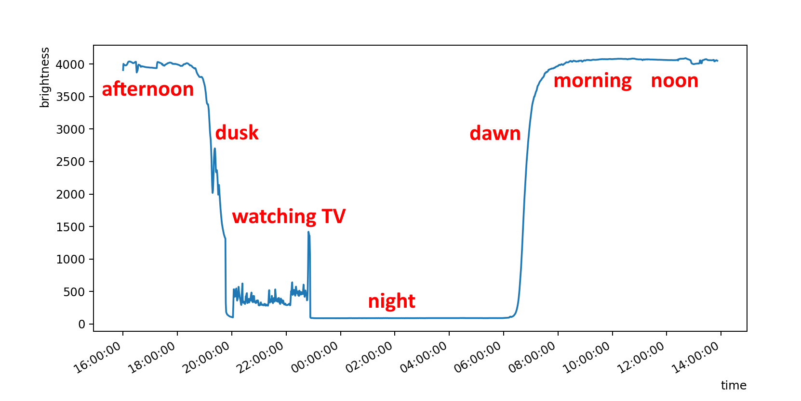
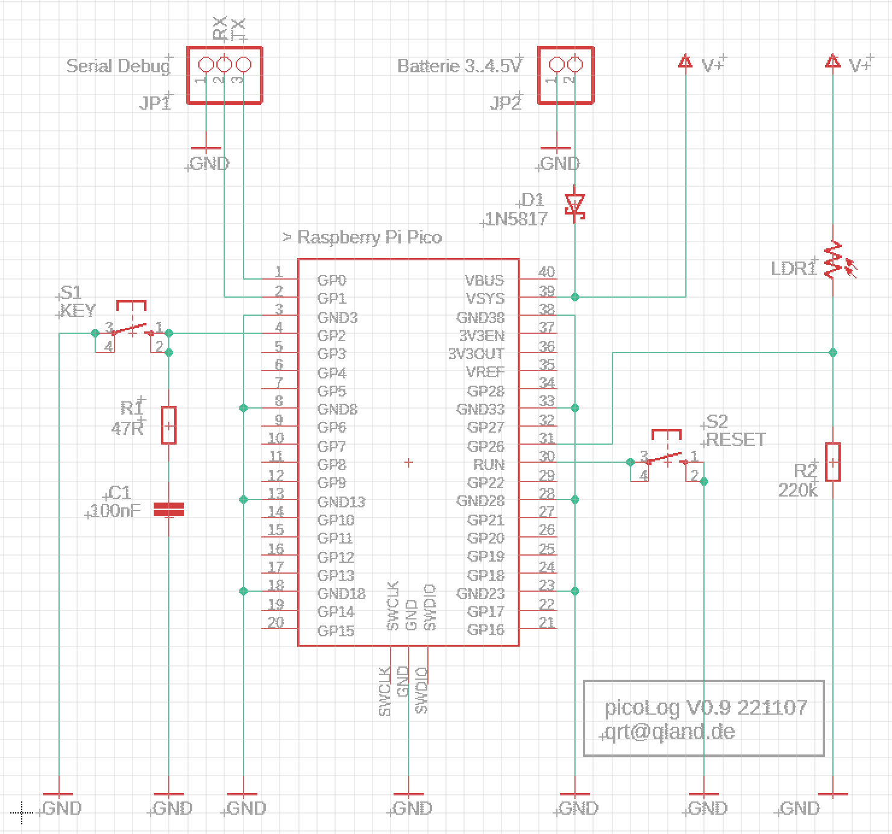

# **PicoLog**
## Battery Driven Logger for Pico

```
Compared with other micro controllers, the power consumption of a Pico RP2040 processor
in sleep mode is relatively high. In sleep mode with running RTC at 3 V it is about 1.2 mA
(without pin change wake up) against some uA for example an AVR controller. Despite that,
dependent on the sample interval, two or three alkaline batteries (~2.800 mAh) in series may
endure some month. This seems sufficient to use the Pico and its ample flash for logging tasks.

To handle sampling, dumping, visualization and settings, the attached python script is useful.

```

<br>

<br>

<br>

<br>
Visualization of the voltage on a LDR-R series connection from afternoon to next day noon  
[-> python script](#links)

<br>

## Preparation
```
- compile and transfer C++ part of picoLog to Pico
  or copy ready compiled .uf2 file via explorer (windows) to Pico
- retrieve used com port in device manager (windows)
  and adapt PORT variable in python script
- to the script Pico must be plugged to PC via USB
```

<br>

## Configuration
```
run python script and choose

1 set date          date and time of sampling                     (default 01.01.2022 00:00:00)
2 set intervals     time between samples from 5 s up to 24 h      (default 15 s)
3 set append        ON  samples are appended to existing ones     (default OFF) 
                    OFF old samples are discarded

settings are stored in Pico flash, time, date, interval and number of samples are copied
to the end of dump files on PC
```

<br>

## Action
```
run python script and choose

s sample            starts sampling, see also point Save Stop
                    the standard LED on Pico will flash on every sample
                    to stop sampling press RESET on Pico
                    samples are written to flash every minute if interval is below one minute
                    Pico will not respond to python script until RESET is pressed
                    if a battery is attached to Pico, you can disconnect the USB cable
                    after start sampling

start sampling      to start sampling without script a battery and START button must be connected
without script      see schematic for details, see also point Save Stop
                    while power up START is pressed      ->  start sampling
                                            not pressed  ->  USB serial for script control

d dump              loads samples from Pico and writes them to a file on PC 
                    (see variable DUMPFILE in python script)
                    before dumping sample some data

v visualize         visualizes dumped data from stored file 
                    (see XTICK_ and AVS variables in python script)
                    before visualizing sample and dump
                      
r remove            deletes samples on Pico
                    settings on Pico and the file on PC are kept

f format            deletes samples on Pico
                    settings on Pico are set to default, the file on PC is kept

a adc               shows some current readings from the ADC of Pico
```

<br>

## Save Stop
```
- stop sampling by pressing RESET
- avoid invalid flash writes by pressing RESET between samples
- save procedure
  hold the START button then press RESET
  then first release START and then RESET
```

<br>

## Links
[-> C++ Source](source_c)  
[-> Python Script](source_py)  
[-> .uf2 File (compiled)](compiled)

<br>

## Schematic


<br>

### Developed and compiled with vsCode, platformIO and wizio-pico
https://code.visualstudio.com/  
https://platformio.org/  
https://github.com/Wiz-IO/wizio-pico  

<br>

---

[qrt@qland.de](mailto:qrt@qland.de) 221108
